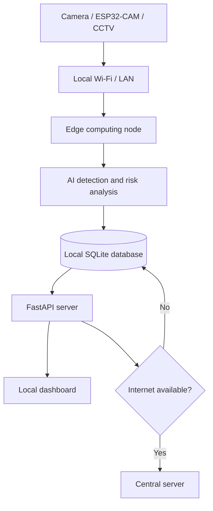

XIM - it is an edge-first video analytics platform for surveillance in remote forests and border areas.

XIM is designed to work with existing CCTV cameras, ESP32-CAM devices, or
webcams and continue recording events when the internet connection is
unavailable.


## Architecture



The intended offline workflow is:

1. Capture video on a local camera.
2. Process detections on the edge node.
3. Calculate a risk score and store the event locally.
4. Show alerts, snapshots, and location data on the local dashboard.
5. Synchronize unsynced events when connectivity returns.

## Local development

Make sure to install nvm in your system for prisma client <install: "https://github.com/nvm-windows/nvm/releases">

** Prisma Setup **
```
-> nvm install 22
-> nvm use 22
-> cd api/
-> uv run prisma generate
```
import prisma for lib/ and write queries.

```
 -> cd api/
 -> uv venv .venv
 -> uv pip install -r requirements.txt
 -> uv run fastapi dev --port <custom-port>  
```

```bash
source .venv/bin/activate
```

## Project structure

```text
api/
	app.py                    FastAPI application entry point
	requirements.txt          Python dependencies
	controllers/api/          API routers
	services/                 Application services
	auth/                     Authentication modules
	lib/                      utitlites for the project
	    prisma/                     prisma modules files
assets/github/              Project images and documentation assets
compose.yaml                Docker Compose configuration
Dockerfile                  Container image definition
```

## Risk scoring concept

The proposed risk scale from the architecture is:

| Score | Risk |
| --- | --- |
| `0-30` | Low |
| `31-60` | Medium |
| `61-100` | High |

## License

No license has been specified for this project yet.